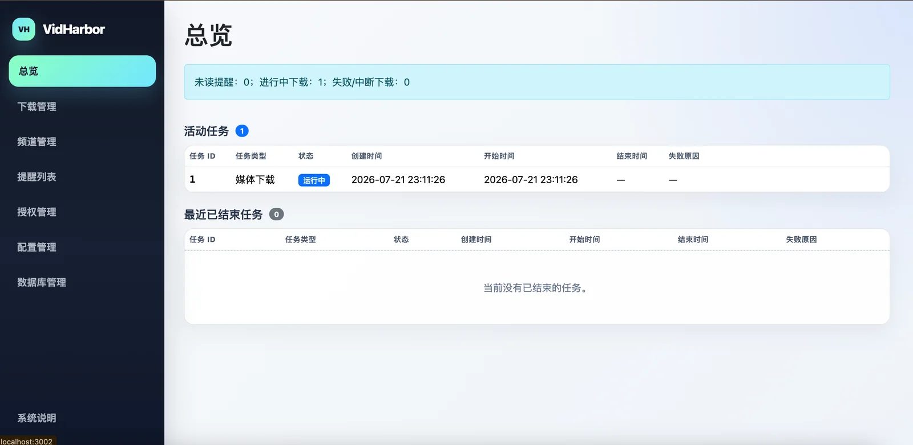
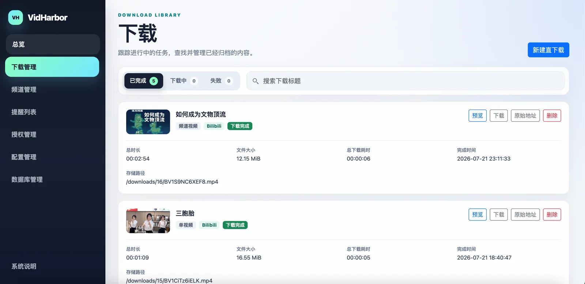
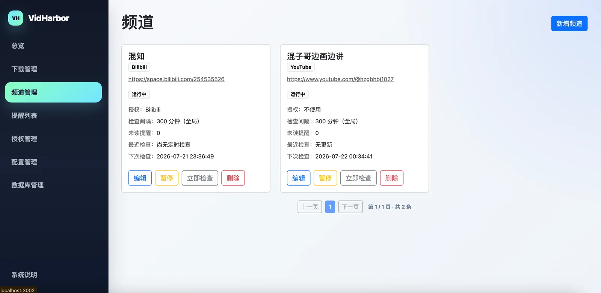
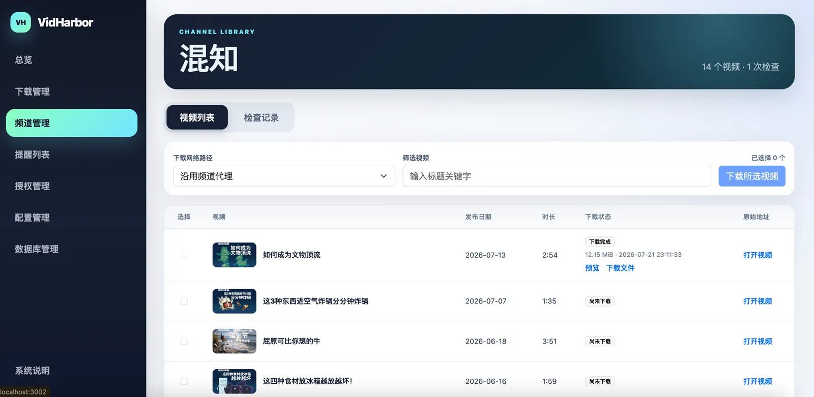
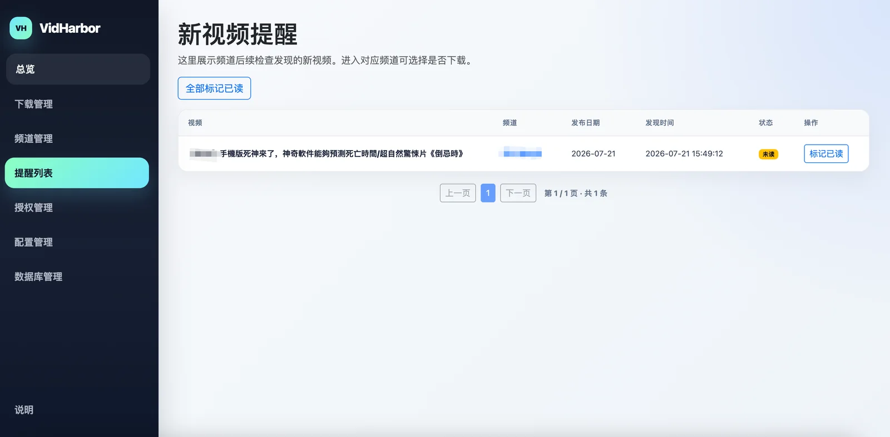
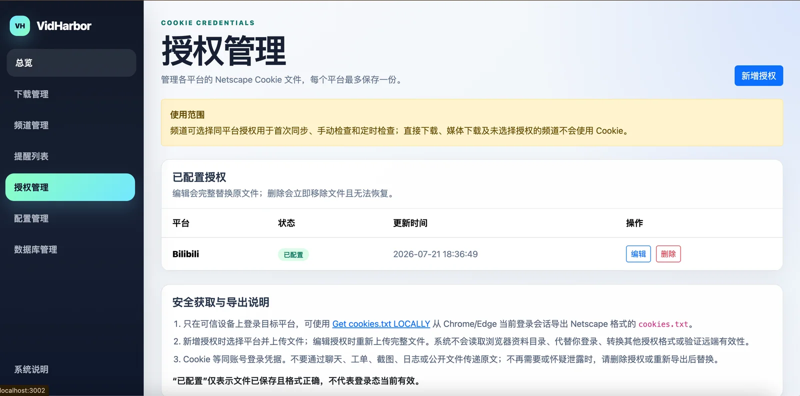
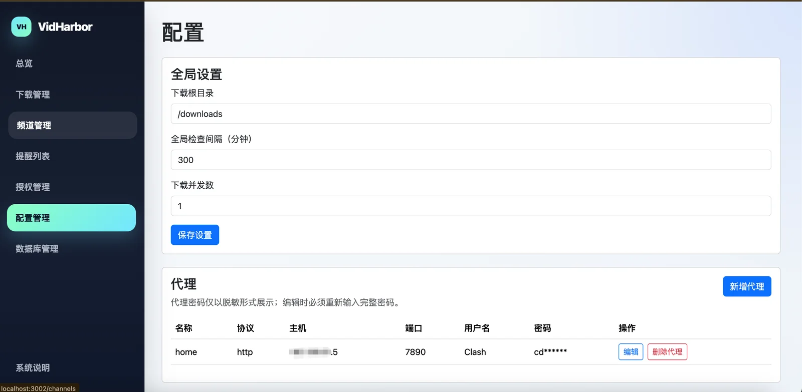

# VidHarbor

[中文](README.md) | English

VidHarbor is a single-user video management tool for trusted private networks. It follows YouTube and Bilibili channels, discovers new videos, provides in-app notifications, and archives videos explicitly selected by the user to local storage.

Its defining characteristics are single-user operation, no login, local storage, and user-controlled downloads.

The project is licensed under GNU AGPL v3.0. See `LICENSE` for the full text.

## Current Features

- Follow YouTube and Bilibili channels, manually synchronize historical videos, and check for new videos on a schedule.
- Discover updates through in-app notifications. Neither historical synchronization nor subsequent checks download videos automatically.
- Create download tasks in batches from a channel's video list, or submit a supported single-video URL directly.
- View download progress, failure reasons, and archive details, and cancel, retry, preview, save, or delete tasks.
- View the fixed download directory and configure check intervals, download concurrency, and named proxies.
- Save one Netscape Cookie file for each of YouTube, Bilibili, X, Facebook, and Douyin under Authorization Management, with upload, full replacement, and deletion support.
- Browse current SQLite data with read-only SQL for local diagnostics and verification.

<!-- APP_GUIDE_EXCLUDE_START -->

## Interface Preview

### Overview



### Downloads



### Channels



### Channel Details



### Notifications



### Authorization Management



### Settings



<!-- APP_GUIDE_EXCLUDE_END -->

## Project Boundaries

VidHarbor never decides what to download automatically. Channel checks only create video records and notifications. The user must explicitly start a download after finding a video on a channel or notification page. A supported single-video URL can also be submitted directly without adding a channel.

> **Deploy only on a trusted private network:** The project has no login, user isolation, or authorization system. Same-origin checks are not authentication, and the service port must never be exposed directly to the public internet.

## From Configuration to Archive

1. **Complete configuration:** Confirm the read-only download root, set the global check interval and download concurrency, and create named proxies if required.
2. **Add a channel:** Submit a supported YouTube or Bilibili channel URL, custom name, network route, and optional channel-specific check interval.
3. **Run the initial sync:** Manually select the most recent 1, 3, 6, or 12 months. Historical videos only enter the list; they do not create notifications or downloads.
4. **Discover updates:** The background scheduler checks the most recent month at the configured interval. Videos not already in the database enter the channel list and create notifications.
5. **Select downloads:** Choose videos from a channel's video list, or submit a single-video URL on the Downloads page.
6. **Archive locally:** A task completes when the main media succeeds. Files are archived in a directory named with the download ID.

## Support Matrix

| Capability | Currently supported | Explicit limitations |
| --- | --- | --- |
| Channel subscriptions | YouTube `/channel/<id>` and `/@handle`; Bilibili `https://space.bilibili.com/<numeric-UID>` | YouTube excludes Shorts, live streams, and live replays. Bilibili includes only regular creator uploads and excludes posts, live streams, series, favorites, collection entry points, and audio. |
| Direct downloads | Verified for public single videos or Reels from YouTube, Bilibili, X, and Facebook; public single-video Douyin URLs can be submitted | Home pages, playlists, and collections are not expanded. A resource must resolve to exactly one entry. Private or login-required content is unsupported. |
| Generic HTTPS probing | Any HTTPS URL enters the existing yt-dlp single-resource probe | This does not make the site officially supported or verified. The URL must still resolve to exactly one entry and satisfy the required metadata contract. |
| Bilibili | Regular videos; use `?p=<number>` to select a part in a multi-part video | The first part is selected when no part is specified. |
| X | A specific video URL | Posts with multiple videos must include `/video/<number>`. |
| Facebook | Public single videos and public Reels | Private, friends-only, age-restricted, and login-required content is unsupported. |
| Douyin | Public single videos at `https://www.douyin.com/video/<numeric-ID>` | yt-dlp may require fresh cookies. Saved Cookies are not connected to probing or downloads, so success depends on the outbound network and platform controls. User profiles and collections are unsupported. |
| Authorization management | YouTube, Bilibili, X, Facebook, and Douyin are fixed supported platforms | At most one Netscape `cookies.txt` file per platform. Other platforms, multiple accounts, and other authorization formats are unsupported. |

A direct-download resource must provide a non-empty `extractor_key`, a title, and an ID safe for archive filenames. The ID may contain only letters, digits, underscores, and hyphens. HTTP URLs, resources missing required metadata, and resources requiring unavailable login information fail explicitly.

Authorization Management only validates and stores Netscape `cookies.txt` files. After blank and comment lines are removed, the file must contain at least one data record, and every data record must contain exactly seven tab-separated columns. Passing validation only means the file was saved and is structurally valid; it does not prove that the login session is currently valid. The system does not display or download raw Cookie contents. Cookies are equivalent to account login credentials and must only be obtained and uploaded on trusted devices. Never send raw Cookie contents through chat, issues, screenshots, logs, or public files.

When adding or editing a channel, authorization for the same platform can be selected. Once selected, the current Cookie file is used for the initial sync, manual checks, scheduled checks, and per-video detail requests. Direct-download metadata probing and media downloading do not use saved Cookies.

## How Channels Discover Videos

### Initial Sync

The user selects the range, which must be the most recent 1, 3, 6, or 12 months. Matching videos are marked as historical and therefore do not create new-video notifications. An initial sync may succeed when the selected range contains no regular videos.

### Subsequent Checks

The range is fixed to the most recent calendar month before the check start time. There is no user option, and the boundary date is included.

Every minute, the scheduler determines which channels are due. A channel-specific interval overrides the global interval; paused channels are skipped. yt-dlp reads regular videos within the publication-date boundary, after which the system compares platform video IDs with the database. Only previously unseen videos create records and notifications.

New videos usually appear after the next scheduled check completes. Discovery latency therefore depends on the check interval, up to roughly one minute of scheduler delay, and the actual time required by the target site and network. The user can also click Check Now.

## Downloads, Success Criteria, and Files

Downloads support video or audio, maximum resolution, transcoding formats, subtitles, and time ranges. Both probing and downloading operate on a single resource and never expand playlists.

- **Success criteria:** A task succeeds once the main media file is downloaded and validated. New tasks also store the main media file size.
- **Thumbnails:** Each task attempts to save one automatically. A missing or failed thumbnail does not affect main-media success.
- **Directory structure:** New tasks are archived under `<downloads-mount>/<download-ID>/`. A directory may contain the main media, thumbnail, and subtitle files.
- **Deletion:** Deleting a completed task using the new layout removes the entire download-ID directory and its database record. Records created before the layout upgrade retain their original file paths.

Downloads do not retry or resume automatically. Failed, canceled, and interrupted tasks can be retried explicitly by the user. A new submission is rejected without creating a duplicate when the same platform and video ID already has a pending, running, or completed record. The user may explicitly recreate a task after failure, cancellation, or interruption. Download records store and display the source platform. The Downloads page has fixed Completed, Active, and Failed views and opens Completed by default. Completed records show only the thumbnail, title, total duration, file size, total download time, completion time, storage path, and actions. Older records whose historical size cannot be determined reliably display `—`.

## Pages

| Page | Purpose |
| --- | --- |
| Overview | View every channel with updates from its latest check, notification and download summaries, all active yt-dlp tasks, and the 30 most recent finished tasks. |
| Downloads | Create a single-video download; view completed, active, and failed tasks separately; and cancel, retry, preview, save, or permanently delete files. |
| Channels | Add and configure YouTube or Bilibili channels, and trigger the initial sync, check now, pause, resume, or delete actions. |
| Channel Details | Filter and select videos for download; view current download state, file size, completion time, failure reason, and file actions; and inspect initial-sync and subsequent-check records. |
| Notifications | View new videos found by subsequent checks, open the original video or channel, and mark one or all notifications as read. |
| Authorization Management | Upload, fully replace, or delete a Netscape Cookie file for YouTube, Bilibili, X, Facebook, or Douyin, and view configuration state and update time. |
| Settings | View the fixed download root, configure the global check interval and download concurrency, and manage HTTP, HTTPS, or SOCKS5 proxies. |
| Database | View tables and run read-only SQL for local diagnostics. Writes are unsupported. |
| System Guide | Display this README without the interface preview. The System Guide link at the bottom of the sidebar points to `/guide`. |

Downloads, channels, channel videos, channel checks, and notifications are paginated by the server at 20 items per page. Search and state filters are applied on the server before pagination. Mark All as Read applies to all notifications, regardless of the current page.

The yt-dlp task snapshot on the Overview page exists only in memory for the current service process. Restarting the service or container clears task history and resets task IDs to 1. Business records such as downloads, channels, and notifications remain in SQLite.

## Quick Deployment and Local Development

The project requires Docker and Docker Compose and supports `linux/amd64` and `linux/arm64`. Intel/AMD Linux, x86_64 servers, and Intel Macs use the AMD64 image. ARM64 Linux, ARM servers, and Apple Silicon use the ARM64 image. Other architectures are unsupported.

### Quick Deployment (Recommended)

For production deployment, use the published multi-architecture image from GitHub Container Registry. You do not need to download the source or build on the deployment machine:

```sh
mkdir vidharbor && cd vidharbor
curl --fail --location \
  https://raw.githubusercontent.com/apanly/VidHarbor/main/compose.image.yaml \
  --output compose.yaml
docker compose up -d
docker compose ps
```

### Local Development

Local development requires the source code and builds an image using pinned Node.js, yt-dlp, FFmpeg, and system package versions. Run `docker compose up --build -d` again after changing code. Before committing, also complete the checks under Local Verification.

```sh
git clone https://github.com/apanly/VidHarbor.git
cd VidHarbor
docker compose up --build -d
docker compose ps
```

By default, Compose listens only on `127.0.0.1:3002`; open `http://localhost:3002`. The container health check requests the Overview page at `GET /`. A healthy status means only that the process can serve the page, not that YouTube, Bilibili, or a proxy is reachable.

To allow access from other devices on a trusted LAN, explicitly change the port mapping in `compose.yaml` to `"3002:3000"` and restrict sources with the host firewall. Never map the port to the public internet.

First-use sequence:

1. Start the service and confirm that the container is healthy.
2. Confirm the read-only download root under Settings, then set the global check interval and download concurrency.
3. If a channel requires a logged-in session, upload the platform's Netscape Cookie file under Authorization Management, then select that same-platform authorization when adding or editing the channel.
4. Create an HTTP, HTTPS, or SOCKS5 named proxy if needed.
5. Add a YouTube or Bilibili channel with a unique custom name.
6. Manually select 1, 3, 6, or 12 months for the initial sync.
7. Select videos from a notification or channel page for subsequent downloads, or submit a single-video URL on the Downloads page.

Direct mode never switches automatically to a proxy, and a failed named proxy never falls back to a direct connection. Cookies are used only by channel sync and checks that explicitly select same-platform authorization. They are not applied automatically to direct downloads or media downloads. The project does not provide automatic proxy selection or proxy pools.

## Data and Operations

Both persistent mounts are required:

- `/data`: Stores the SQLite database and `cookies/` directory. The default database file is `/data/vidharbor.db`; it contains channels, videos, notifications, download state, configuration, and potentially plaintext proxy credentials. `/data/cookies/` stores Cookie login credentials.
- `/downloads`: Stores download archives and is the application's fixed download root. Change the Compose volume mount to use a different host storage location.

The project supports one container and one instance only. The in-process scheduler and FIFO download queue provide no coordination between replicas. Stop the container before backing up SQLite, and keep both the database and download directory on persistent mounts.

The Database page displays query results, including potential plaintext credentials in the proxy table. It rejects write SQL but provides no field redaction, query-result authorization, or resource isolation, so it must also be used only on a trusted private network.

Raw Cookie contents are equivalent to account login credentials. The Authorization Management page and API show only whether a file is configured and when it was updated; they do not expose the contents. Access to `/data` on the host must still be restricted, and its backups must be protected as account credentials.

When using bind mounts, create the host directories first and ensure that the container user can read, write, and enter them. Continuously monitor `/downloads` capacity, permissions, and mount state.

### Backup

A backup must include both `/data` and `/downloads`. The commands below stop the application before creating two archives from the current container mounts:

```sh
mkdir -p backups
docker compose stop app
docker run --rm \
  --volumes-from "$(docker compose ps -aq app)" \
  -v "$PWD/backups:/backup" \
  alpine:3.22 \
  sh -c 'tar czf /backup/vidharbor-data.tgz -C /data . && tar czf /backup/vidharbor-downloads.tgz -C /downloads .'
docker compose start app
```

`vidharbor-data.tgz` contains Cookie login credentials and potentially plaintext proxy credentials. `vidharbor-downloads.tgz` contains downloaded media. Both archives must be treated as sensitive data, and the `/data` backup must be protected as account credentials. To restore, stop the application and extract the archives into empty `/data` and `/downloads` mounts respectively. Never replace the SQLite file while the application is running.

### Upgrade

Complete a backup before upgrading. In a quick-deployment environment, run:

```sh
docker compose pull
docker compose up -d
docker compose ps
```

In a local development environment, run:

```sh
git pull --ff-only
docker compose up --build -d
docker compose ps
```

Database migrations run automatically at startup. The project does not guarantee that an older version can read a database migrated by a newer version, so rolling back the code also requires restoring the pre-upgrade `/data` backup.

## Failure Handling

- A failed channel check records its failure reason. It is never presented as No Updates and does not block other channels.
- A failed named proxy never switches automatically to direct mode; direct mode never searches for a proxy.
- A failed download does not affect other tasks or overwrite an existing archive directory or file.
- After a service restart, unfinished downloads are marked Interrupted, while unfinished initial syncs and channel checks are marked Failed. None retry automatically.
- If a file is missing or deletion fails, the database record is retained and an explicit error is returned, avoiding a deleted record with unknown file state.
- A full disk, lost mount, existing target, zero-byte output, out-of-bounds path, or non-zero yt-dlp/FFmpeg exit makes the corresponding task fail explicitly.

Currently unavailable: automatic downloads, automatic retries, external push notifications, notification deletion, channel URL changes, connecting saved Cookies to channel/probe/download operations beyond explicitly authorized channel sync and checks, remote Cookie validity checks, proxy pools, automatic proxy selection, and secure public-internet access.

## Local Verification

The default tests are fully offline. They use temporary SQLite databases, temporary download directories, and fake yt-dlp/FFmpeg executables. They never access the public internet or use real proxy credentials.

```sh
npm ci
npm test -- --run --maxWorkers=1
npm run build
```

Real-site smoke tests are not part of the default test suite. Before upgrading pinned yt-dlp, FFmpeg, the Node.js base image, or native dependencies, verify YouTube and Bilibili channel metadata; single resources from YouTube, Bilibili, X, Facebook, and Douyin; downloads requiring FFmpeg merges; atomic archiving; and proxy and direct paths on each target CPU architecture and deployment network.

## Project Documentation

- Documentation index: `docs/README.md`
- Contributing guide: `CONTRIBUTING.md`
- Security policy: `SECURITY.md`
- Changelog: `CHANGELOG.md`

## License

Copyright (C) 2026 VidHarbor contributors.

VidHarbor is licensed under the GNU Affero General Public License v3.0, SPDX identifier `AGPL-3.0-only`. If you modify this project and provide it to users over a network, you must make the complete source code of that version available to those users as required by the license. Refer to `LICENSE` for the definitive rights and obligations.
