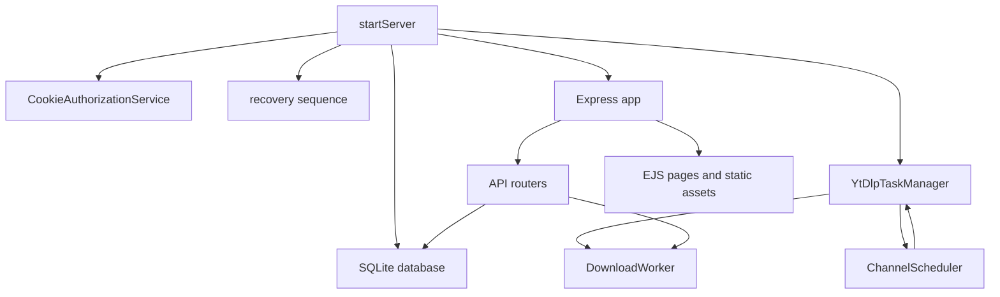

# 运行时架构

VidHarbor 是部署在可信内网的单用户 Node.js 服务。`src/server.ts` 的 `startServer()` 是唯一运行时组合根；`src/app.ts` 只组装 Express 和路由。业务状态在 SQLite，下载与频道检查通过同一个 `YtDlpTaskManager` 驱动外部 yt-dlp；因此不支持多实例部署：内存中的队列、任务快照、SSE 注册和调度器都没有跨进程协调。

图示为启动后 HTTP、调度和下载共用持久化数据库与 yt-dlp 任务管理器的关系。

## 启动与恢复

`startServer()` 依次执行：验证下载挂载可读写可进入、运行 `yt-dlp --version` 与 `ffmpeg -version`；初始化 Cookie 目录；打开 SQLite 并执行迁移；恢复未完成频道同步；清理 `.vidharbor-tmp/<id>`；把 `pending`、`downloading`、`running` 下载变为 `interrupted`；收敛 `deleting` 下载；读取 `settings.download_concurrency`；创建任务管理器/worker；启动一分钟一次的调度器；最后监听 HTTP。

恢复细节和状态归属见 [持久化](persistence.md)、[下载工作流](../downloads/workflow.md) 与 [频道工作流](../channels/workflow.md)。临时清理只会删除数据库已知、当时中断的下载 ID 对应的 `.vidharbor-tmp/<id>`；临时根和任务目录均须为真实目录、位于下载根内且任务目录不得是符号链接，任何异常都会阻止启动以避免越界删除。`test/integration/server-lifecycle.test.ts` 验证启动依赖、事件顺序和失败清理；`test/integration/restart-recovery.test.ts` 验证耐久状态的收敛。

`download_concurrency` 只在此启动阶段由 `loadDownloadConcurrency()` 读取，用于构造不可变并发上限的 `YtDlpTaskManager`。`PUT /api/settings` 虽会持久化新值，但不会重配已经创建的管理器；修改下载并发度后必须重启服务才生效。

## 故障与关闭

`RuntimeCoordinator` 是后台故障汇聚点：worker 的边界失败、调度器未记录的失败，以及 SSE 轮询异常都会拒绝 `RunningServer.failure`。所有进入该路径的错误先使用启动时加载的代理 URL 列表经 `redactStderr()` 脱敏，才形成 failure 消息。`main()` 捕获该 Promise 后设置失败退出码并调用 `stop()`。已被业务记录的频道获取/元数据失败和用户取消不会被当作运行时崩溃。

关闭顺序刻意先停止调度和任务管理器（取消活动任务），关闭已注册下载 SSE，再停止 HTTP；随后等待调度/任务边界和 worker 空闲，最后关闭数据库。`stop()` 是幂等的。此顺序避免在数据库关闭后仍有后台写入，也避免长连接阻塞 HTTP 关闭。

## 分层与边界

- `src/routes/`：解析 HTTP 参数、调用服务、返回 JSON 或文件流；公共契约见 [HTTP API](../api/http-contract.md)。
- `src/services/`：业务规则、状态转换和 SQLite 事务；下载与频道分别有 canonical 页面。
- `src/db/`：连接设置与迁移，拥有模式兼容性规则。
- `src/yt-dlp.ts`：子进程边界；`src/filesystem.ts` 和 `src/redaction.ts` 分别负责路径安全与敏感文本处理。
- `src/views/`、`src/public/` 和 `src/i18n.ts`：服务端页面、浏览器行为和语言目录，见 [Web 界面](../web/interface-and-i18n.md)。

运行时默认配置来自 `src/config.ts`：端口 `3000`、数据库 `/data/vidharbor.db`、下载挂载 `/downloads`；容器部署语义见 [安全与配置](../operations/security-and-configuration.md)。