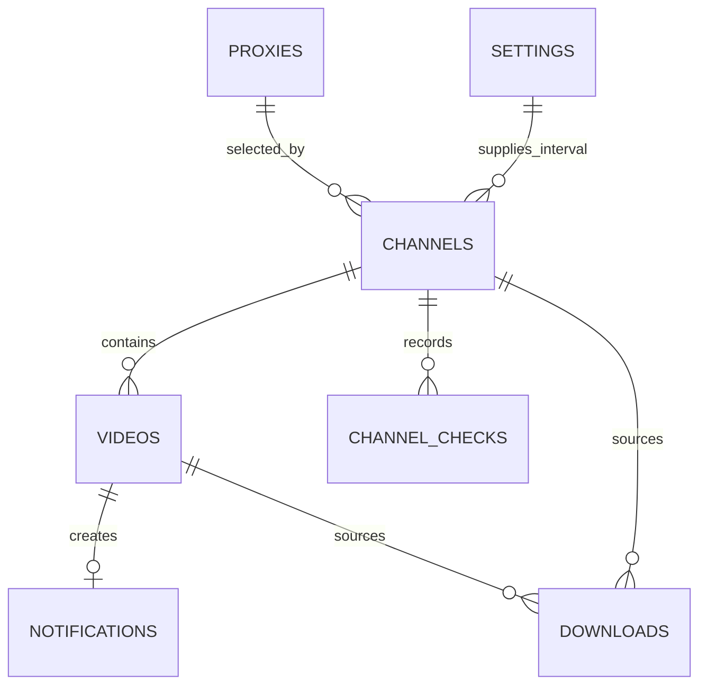

# SQLite 模式、迁移与耐久状态

`src/db/client.ts` 用 `better-sqlite3` 打开单一 SQLite 数据库，并启用 `foreign_keys = ON`、WAL 和五秒 `busy_timeout`。数据库是频道、视频、提醒、下载、代理和设置的唯一耐久真源；yt-dlp 任务快照与 SSE 注册仅在进程内。

图示为最终迁移模式中业务实体的关键外键和逻辑关系。

## 迁移协议

`src/db/migrate.ts` 内置按顺序读取的 001--008 SQL 文件。每次迁移先关闭外键并以 `BEGIN EXCLUSIVE` 锁定，执行 `integrity_check` 与 `foreign_key_check`；新库依次建立模式、`schema_migrations` 和唯一的 `settings.id = 1`，旧库只能拥有连续且不超过当前版本的版本序列。完成后它把实际 `sqlite_schema` 与在内存库应用全部迁移后的模式逐字比较，并再次检查完整性，任何未知版本或模式漂移都会失败而非猜测修复。

迁移 `002`、`006`、`008` 会重建受约束的表；新增迁移不仅要增加 SQL 文件，还必须追加 `MIGRATIONS` 数组。测试以 `test/integration/database.test.ts` 和 `test/integration/restart-recovery.test.ts` 覆盖迁移与恢复；升级不保证旧程序可读取已升级库，回滚必须同时恢复旧 `/data` 备份。

## 实体与不变量

- `settings` 是单例，保存全局检查间隔和下载并发度；频道以 `COALESCE(channel override, global)` 获取有效间隔。
- `channels` 保存平台、唯一自定义名、可选代理和授权平台、首次同步状态与最近检查信息；`videos` 以 `(platform, platform_video_id)` 全局唯一。
- `notifications` 对每个视频至多一条；只有后续发现的 `new` 视频创建提醒，历史同步的视频不创建提醒。
- `downloads` 保存来源、代理 URL 快照、可选高级选项、状态和归档元数据。新布局是 `<downloads>/<id>/`；`legacy_file` 用于升级前单文件记录。
- 外键默认阻止删除被引用的代理、频道和视频。服务在删除频道或授权前还执行业务级引用检查。

## 耐久状态与事务

下载状态为 `pending`、`running`、`completed`、`failed`、`canceled`、`interrupted`、`deleting`（兼容旧的 `downloading`）。worker 用 `WHERE status = 'pending'` 原子认领；创建、删除标记和复杂频道写入使用 `BEGIN IMMEDIATE`，确保单写入者转换。完成必须有输出路径；失败、取消、中断必须有失败原因且没有输出；`deleting` 保留输出路径，供恢复继续收敛。

频道首次同步为 `pending -> syncing -> succeeded|failed`；`channel_checks` 记录 initial 或 scheduled 检查，并以事务同时写视频、提醒、检查结果和下次检查时间。定时检查只为此前未保存的平台视频 ID 插入视频和提醒。提醒批量标记已读也在事务中先确认全部 ID 存在，避免部分成功。

重启时 `recoverInterruptedChannelSyncs()` 把未结束 initial/scheduled 检查和对应频道变为失败；`recoverInterruptedDownloads()` 把活动下载变为 `interrupted`；`recoverDeletingDownloads()` 处理遗留删除。`test/integration/download-delete-recovery.test.ts` 覆盖两阶段删除、部分删除和并发所有权；`test/integration/restart-recovery.test.ts` 覆盖频道和下载的恢复。