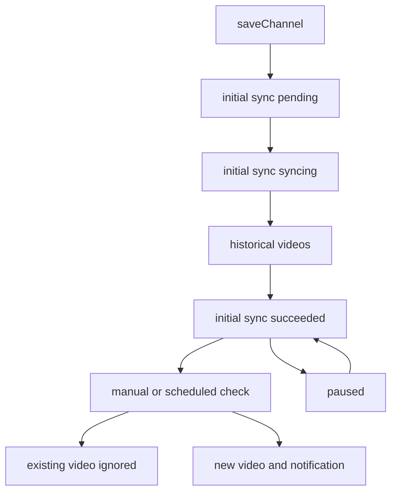

# 频道同步、发现与提醒

`src/services/channel.ts` 是频道域的状态所有者，`src/services/channel-metadata.ts` 对 yt-dlp 元数据做平台特定验证，`src/routes/channels.ts` 暴露 API。频道只发现视频和创建提醒，绝不自动下载；用户在频道详情页另行调用下载 API，见 [下载工作流](../downloads/workflow.md)。

图示为首次同步建立基线，后续检查仅对新增视频产生提醒的生命周期。

## 创建与首次同步

可保存的 URL 仅为 `https://www.youtube.com/` 下的频道/handle 或 `https://space.bilibili.com/` 数字 UID；`parseChannelSource()` 归一化 YouTube URL，并为 Bilibili 选择 `BilibiliSpaceVideo`。自定义名需 NFC、非空、无路径分隔符、最多 80 字符和 255 UTF-8 字节，且按小写唯一。若选择授权，授权平台必须与频道平台一致，路由在写入前要求 Cookie 文件已配置。

`POST /:id/initial-sync` 只接受 1、3、6、12 月。它先在事务中把 pending/failed 变为 syncing 并创建 `channel_checks`，随后提交异步 `channel_initial_sync`。初始同步读取区间内视频并以 `historical` 写入，允许零个条目，不生成提醒；成功后记录平台频道 ID、下次检查时间和 `succeeded`。初始同步进行中或成功后不能再次执行；失败可重试。重启把未完成同步标为 failed。

## 元数据和后续检查

YouTube 获取 `<channel>/videos`，对扁平条目缺日期时再探测单视频，并验证一致的 `channel_id`、唯一视频 ID、正常非直播状态、URL、标题和日期。Bilibili 先获取扁平空间列表，再逐条探测，要求 uploader ID 匹配空间 UID；旧于边界时停止。两平台都会拒绝重复/不合法元数据而非写入部分结果。

手动 `POST /:id/check` 和 `checkScheduledChannel()` 都检查最近一个月。它们在 `channel_checks` 开始行后调用 yt-dlp，随后在同一事务中：必要时填充未知的频道 ID，跳过数据库已有的平台视频 ID，插入每个新 `videos` 行和唯一 `notifications` 行，写 `success` 或 `no_updates`，并按频道覆盖值或全局值更新 `next_check_at`。获取或元数据错误写入 failed 结果和经脱敏的原因。

暂停只设置 `paused_at`；恢复清除它并从恢复时刻加有效间隔重新计算下次检查。删除频道前必须没有下载记录和未完成检查，然后删除其提醒、检查和视频。通知 API 只读取和标已读；批量标记先验证所有 ID，`read-all` 不受分页限制。

## 授权、代理和测试

频道同步/检查和频道视频下载可传同平台 Cookie 文件与选定代理给 yt-dlp；直接下载会在 URL 属于已配置平台时自动传同平台 Cookie。Cookie 生命周期见 [安全与配置](../operations/security-and-configuration.md)。调度条件和并发互斥见 [yt-dlp 与调度](../runtime/yt-dlp-and-scheduling.md)。

- `npm test -- --run test/integration/channel-initial-sync.test.ts`：首次同步范围、失败与历史无提醒。
- `npm test -- --run test/integration/channel-scheduled-check.test.ts`：去重、新提醒、Bilibili、代理与失败脱敏。
- `npm test -- --run test/integration/channel-notification-api.test.ts`：路由、分页和已读行为。
- `npm test -- --run test/unit/youtube.test.ts test/unit/bilibili.test.ts`：URL/元数据平台解析。