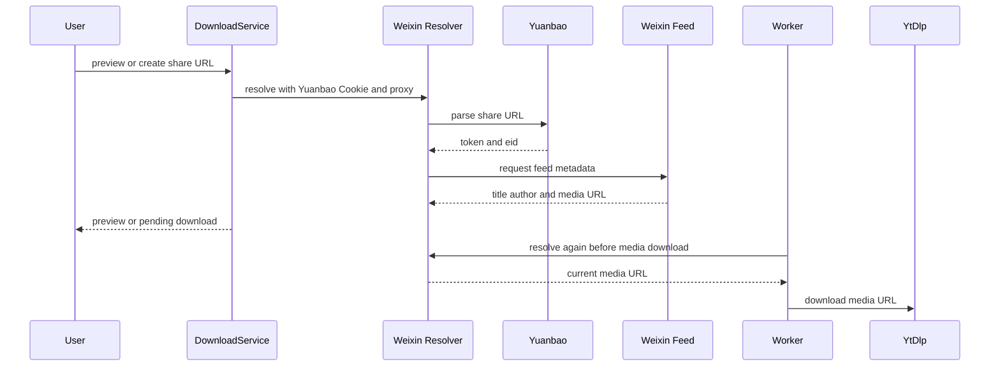

# 微信视频号直连下载

视频号是直连下载的一条专用分支，而非 yt-dlp 元数据探测的扩展。`src/services/download.ts:probeDirectDownload()` 以 `isWeixinVideoHost()` 识别候选地址，随后由 `parseWeixinShareUrl()` 只接受规范的 `https://weixin.qq.com/sph/<短ID>` 分享 URL；不能接受查询串、片段、端口、用户名或密码。它需要已配置的 `yuanbao` Cookie，缺失时创建或预览都会失败。

图示展示预览/创建阶段取得显示元数据，以及 worker 在实际下载前重新解析短时效媒体 URL 的两次解析边界。

## 解析与传输契约

`resolveWeixinVideo()` 读取 Netscape Cookie 文件，只挑选与元宝解析端点域名、路径、安全标志和有效期匹配的条目；没有匹配 Cookie 即报 `VIDEO_FETCH_FAILED`。它先向元宝解析端点提交分享 URL，从返回的可播放地址取得唯一的 `token` 和 `eid`，再请求视频号 feed 端点，提取描述、作者昵称和 HTTPS 媒体 URL；后一个请求不携带 Cookie，但附带固定 `Origin` 与 `Referer`。两个请求都可使用 `ProxyAgent`，30 秒超时，并在结束时销毁 agent。

这条流程的凭据来源和上传保护由[安全与配置](../operations/security-and-configuration.md)定义：只有 `CookieAuthorizationService` 管理的 `yuanbao.cookies.txt` 可供解析器使用，Cookie 内容不出现在 API 响应或日志中。下载服务只保存代理 URL 快照；重试时重新取得当前元宝 Cookie 路径，仍使用该快照代理。

## 创建、worker 与文件名

`previewDirectDownload()` 返回平台 `weixin`、短 ID、标题、无时长和按作者建议的目标子目录；`createDirectDownload()` 将高级选项固定为 `null`，把元宝 Cookie 路径作为 `weixinCookieFilePath` 仅交给队列。它仍遵守[下载工作流](workflow.md)的重复下载约束、`pending` 持久化、目标子目录验证和重试状态机。

`DownloadWorker.#run()` 在每次执行时再次调用 `resolveWeixinVideo()`，因此不复用预览阶段可能失效的 CDN URL。若解析期间发生取消，worker 先检查任务信号并按取消路径收敛，不能把取消误记为普通失败。worker 将解析出的媒体 URL 交给 yt-dlp，但不将元宝 Cookie 再传给 yt-dlp；视频号任务不下载缩略图。CDN URL 的通用 yt-dlp ID 可能含签名查询串并超出文件名长度限制，所以输出模板采用分享短 ID `platformVideoId`，不是 `%(id)s`。

## 修改指南与验证

- 修改 URL 接受范围、Cookie 筛选、端点请求头、响应校验、代理或超时：从 `src/weixin.ts` 的 `parseWeixinShareUrl()`、`cookiesForEndpoint()`、`postJson()`、`resolveWeixinVideo()` 开始。`test/unit/weixin.test.ts` 的相关 `describe` 覆盖规范 URL、Cookie 匹配、来源头、失败响应、代理销毁与取消信号；运行 `npm test -- --run test/unit/weixin.test.ts`。
- 修改创建、预览或重试接线：同时检查 `probeDirectDownload()`、`createDirectDownload()`、`retryDownload()` 和 `CookieAuthorizationService`。运行 `npm test -- --run test/integration/download-service.test.ts test/integration/download-api.test.ts`。
- 修改 worker 行为：保持“执行时重解析、取消优先、无缩略图、短 ID 命名”四项约束；查看 `test/integration/download-worker.test.ts` 中包含 `weixin` 的用例，运行 `npm test -- --run test/integration/download-worker.test.ts`。

不需要为仅修改解析器运行 Docker 或全量测试；若改变 Cookie 平台集合、上传格式或公开授权 API，再补跑 `test/unit/cookie-authorization.test.ts test/integration/cookie-authorization-api.test.ts`。