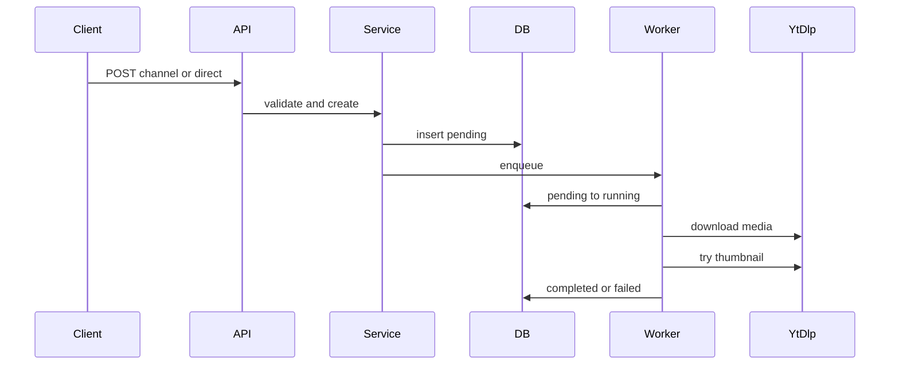

# 下载创建、归档与删除

下载域由 `src/routes/downloads.ts`、`src/services/download.ts` 与 `src/download-worker.ts` 共同拥有。路由是 HTTP 面，服务负责验证/持久化转换，`DownloadWorker` 是 `DownloadQueue` 实现并通过 [yt-dlp 运行时](../runtime/yt-dlp-and-scheduling.md) 执行介质任务。

图示为创建后由 worker 认领、执行并收敛状态的下载主路径。

## 创建与去重

`POST /api/downloads/channel` 接受不重复的 `videoIds` 和 `proxyId`（`channel`、明确代理或直连），从频道视频加载平台、标题、URL 与频道代理。`POST /api/downloads/direct` 仅接受 HTTPS URL、可选代理及完整高级选项对象；它先提交 `metadata_probe`，要求恰好一个结果且包含非空 `extractor_key`、标题和安全 ID。两种路径都验证下载根，并拒绝同一 `(platform, platform_video_id)` 已处于 pending/running/completed/deleting 的记录；失败、取消和中断记录可以重试。

创建在 SQLite 中插入 `pending` 并保存代理 URL 快照。快照意味着以后编辑/删除代理不改变已创建任务。频道下载不带高级选项；直连任务保存媒体类型、格式、质量、转码、字幕、章节和时间段选项。

## worker、归档与失败

`DownloadWorker.#run()` 仅原子地将 pending 转为 running。它在 `<root>/.vidharbor-tmp/<id>` 创建受目录边界验证的临时目录，接收 yt-dlp 的 `after_move:filepath`，要求任务目录只有非空普通文件，并可选下载一个缩略图。缩略图失败不影响主媒体；取消会中断全部后续工作。

完成时 worker 在 `<root>/<id>/` 创建归档目录，对每个产物创建硬链接，删除临时目录，然后将主输出路径、缩略图、字节数、完成时间与 `completed` 一次写入。归档或清理失败会移除已链接文件并记录 `failed`；worker 自身无法安全收敛的边界故障会向运行时报告。路径校验使用 `realpath`、包含关系、`O_NOFOLLOW` 及 inode/dev 对账，详见 [安全与配置](../operations/security-and-configuration.md)。

取消只允许 pending/running/downloading，服务先写 `canceled` 再请求队列取消。重试只允许 failed/canceled/interrupted，清空产物、进度和时间戳，恢复 `pending` 后重新入队。进程重启不续传，活动记录变 `interrupted`，用户必须重试。

## 文件服务与删除

完成任务的 `/media`、`/file`、`/thumbnail` 经 `getDownloadFile()` 或 `getDownloadThumbnail()` 再次验证路径后流式发送；支持 `Range`、`HEAD` 和 416 响应。`/media` 以内联方式服务，`/file` 强制附件。SSE `/api/downloads/events` 每十秒比较分页快照，仅变化时发送。

删除失败/取消/中断记录只删除行。删除完成记录是持久的两阶段过程：先验证主文件及新布局目录，使用 `BEGIN IMMEDIATE` 赢得 `completed -> deleting`，再把整个 `<root>/<id>`（或旧单文件）移入 `.vidharbor-delete/<id>` 隔离区、递归删除，最后删除行。失败时只有主媒体仍为非空安全普通文件才恢复 completed；否则保留 deleting，让启动恢复重试。`recoverDeletingDownloads()` 逐行重放该收敛步骤：归档仍在时继续隔离并删除，原归档和隔离区都不存在时只硬删除遗留行；任何非 `ENOENT` 的文件系统异常会失败关闭，留下 deleting 以待下一次成功启动。并发第二个请求得到 `DOWNLOAD_DELETE_IN_PROGRESS`。

## 聚焦验证

- `npm test -- --run test/integration/download-service.test.ts`：创建、取消、重试和状态约束。
- `npm test -- --run test/integration/download-worker.test.ts`：归档、进度、取消和 worker 边界。
- `npm test -- --run test/integration/download-delete-recovery.test.ts`：删除隔离、部分失败和恢复。
- `npm test -- --run test/unit/filesystem.test.ts test/unit/file-stream.test.ts`：路径和流关闭安全。